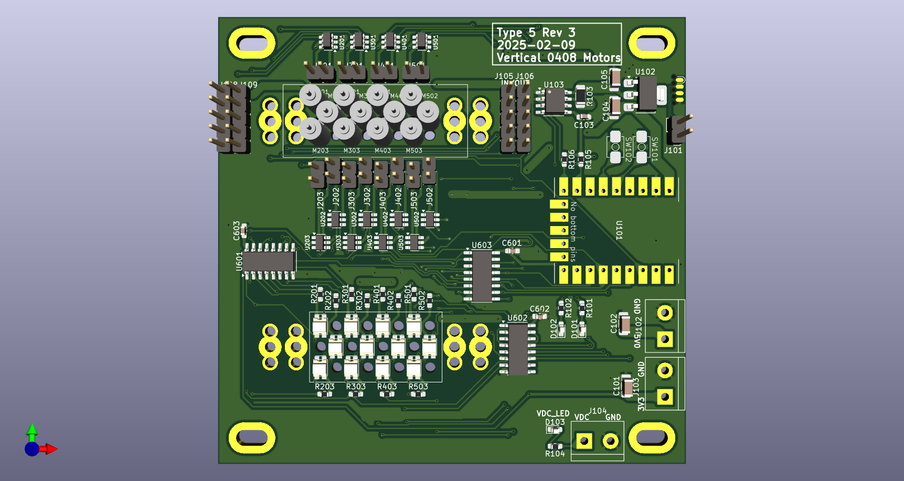

# Braille-Display-DC-Motors-Vertical

Braille display POC using 0408 DC motors, vertically inline under each dot, to spin a bolt for each dot. Includes CAD, PCB, and Firmware. 

**Type 5:** Vertical DC motors.

